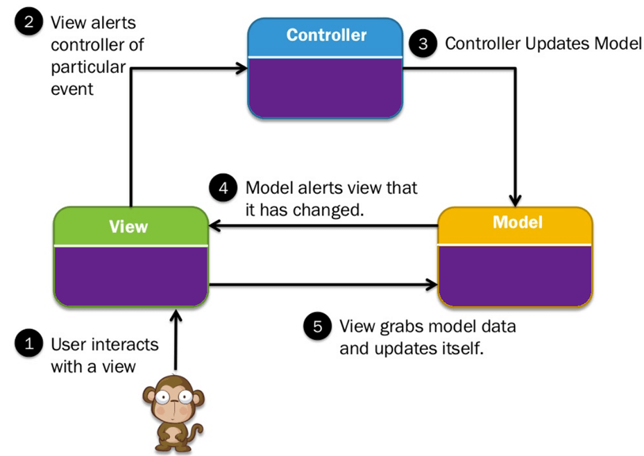

# Working with MVC Flask Framework

# **MVC MODEL VIEW CONTROLLERS**

**What is it?**
* **Model** - Flask micro-framework
* **Controller** - HTML, CSS, JavaScript with **Python** :snake:
* **View** - View the information in a web browser _[Display HTML and Python]_
    * Passed an argument at run time in the browser and displayed the info



**Importing the flask Module and using the micro-framework to incorporate MVC**
```python
from flask import Flask
```

In order for us to use flask we need to create an instance of our app like so...

```python
app = Flask(__name__)
```

> `Syntax to create flask instance (__name__)`

syntax for decorators to create a web route is @/route, Create a welcome method to display on home/ default page.
Whatever happens after the '/' will be the URL in the browser view.

```python
@app.route("/")  # Default page start http://127.0.0.1:5000/
def index():
    return user_page("John")
```

We also printed a basic HTML page with a header.

```python
@app.route("/")  # Default page start http://127.0.0.1:5000/
def index():
    return "<h1>Welcome to MVC with flask project</h1>"
```

**Important**

To run this application we first need to go to the **Terminal** and do the following:

* `set FLASK_ENV=development`
* `run FLASK`  _Whilst you are in the directory where the base flask app is located._

It is also essential that you add a block of code to run the app when you run it in the terminal. 

`debug=True ensure to update any changes without re-running the app`

```python
if __name__ == '__main__':
    app.run(debug=True)
```

### **Exercise**

We also created another function which took in a username, dynamically within the URL with a `<username>` tag in the `@app.route`
decorator.

```python
@app.route("/<username>")  # Default page start http://127.0.0.1:5000/<username>
def user_page(username):
    return f"<h1>Welcome to Python flask app dear {username} </h1>"
```

# HTML

We did some **HTML**, **Bootstrap** (a **HTML** framework that allows responsive design with a `mobile-first` directive)

We also did some inheritance or OOP web design using the 'extends' keyword. We created a `master.html` file that extends into
the `index.html` and shows everything as a result.

```html
<head>
    <meta charset="UTF-8">
    <meta name="viewport" content="width=device-width, initial-scale=1, shrink-to-fit=no">
    <title> Engineering 67 </title>
    <link rel="stylesheet" href="https://stackpath.bootstrapcdn.com/bootstrap/4.3.1/css/bootstrap.min.css"
          integrity="sha384-ggOyR0iXCbMQv3Xipma34MD+dH/1fQ784/j6cY/iJTQUOhcWr7x9JvoRxT2MZw1T" crossorigin="anonymous">
</head>
```

Here we showed that we want to get the block specified, as of now we have not specified what not to select so it takes all the
information in the master file. 